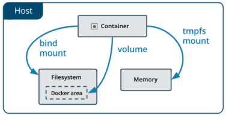
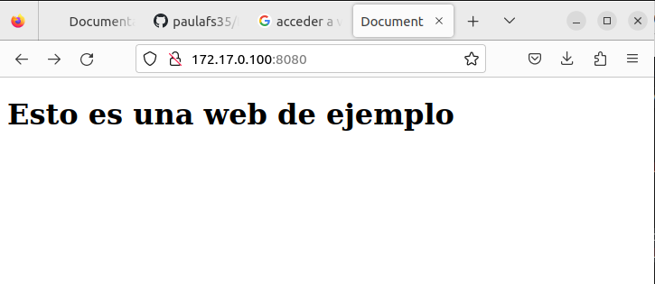

# Docker

[TOC]

> Paula Fernández Suárez - 2º DAW 



## Volúmenes y Bind mount

### Volúmenes

1. Crea un volumen docker que se llame `miweb`.

   ```shell
   docker volume create miweb
   ```
   
   

2. Crea un contenedor desde la imagen `php:7.4-apache` donde montes en el directorio `/var/www/html` (que sabemos que es el *DocumentRoot* del servidor que nos ofrece esa imagen) el volumen docker que has creado. 

   ```shell
   docker run -d --name apache-container -p 8080:80 -v miweb:/var/www/html php:7.4-apache
   ```
   
   

3. Utiliza el comando `docker cp` para copiar un fichero `index.html` en el directorio `/var/www/html`. 

   ```shell
   docker cp index.html apache-container:/var/www/html/
   ```
   
   

4. Accede al contenedor desde el navegador para ver la información ofrecida por el fichero `index.html`.

   
   

5. Borra el contenedor 

   ```shell
   docker stop apache-container
   docker rm apache-container
   ```
   
   

6. Crea un nuevo contenedor y monta el mismo volumen como en el ejercicio anterior. 

   ```shell
   docker run -d --name apache-container -p 8080:80 -v miweb:/var/www/html php:7.4-apache
   ```
   
   

7. Accede al contenedor desde el navegador para ver la información ofrecida por el fichero `index.html`. ¿Seguía existiendo ese fichero?

   El archivo seguía existiendo.
   

   
### Bind mount

1. Crea un directorio en tu host y dentro crea un fichero `index.html`. 

   ```shell
   mkdir bindMountFolder 
   cp index.html ./bindMountFolder/index.html 
   cd bindMountFolder
   ```
   
   

2. Crea un contenedor desde la imagen `php:7.4-apache` donde montes en el directorio `/var/www/html` el directorio que has creado por medio de `bind mount`. 
   
   ```shell
   docker run -d --name apache-container -p 8080:80 -v /home/server_admin/bindMountFolder:/var/www/html php:7.4-apache
   ```
   

   

3. Accede al contenedor desde el navegador para ver la información ofrecida por el fichero `index.html`. 
   

   

4. Modifica el contenido del fichero `index.html` en tu host y comprueba que al refrescar la página ofrecida por el contenedor, el contenido ha cambiado. 
   
   ```shell
   nano bindMountFolder/index.html
   ```
      
   


5. Borra el contenedor 

   ```shell
   docker stop apache-container
   docker rm apache-container
   ```
   


6. Crea un nuevo contenedor y monta el mismo directorio como en el ejercicio anterior. 

   ```shell
   docker run -d --name apache-container -p 8080:80 -v /home/server_admin/bindMountFolder:/var/www/html php:7.4-apache
   ```
   


7. Accede al contenedor desde el navegador para ver la información ofrecida por el fichero `index.html`. ¿Se sigue viendo el mismo contenido?

   Se sigue viendo la misma página.
   
