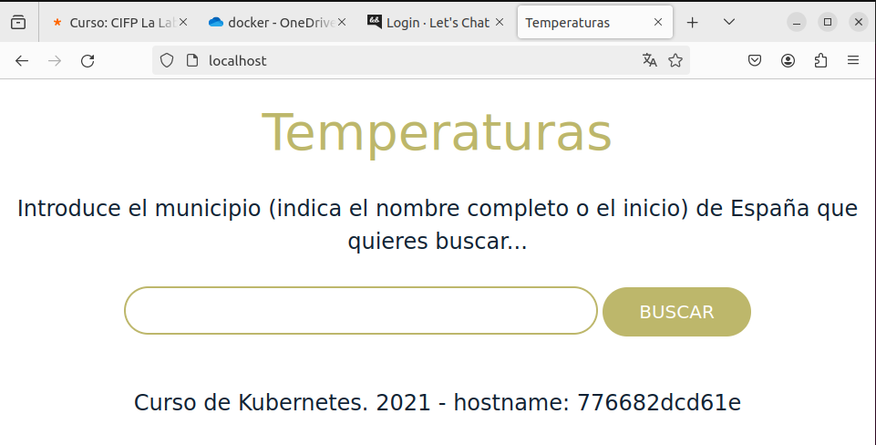

# Docker: Docker compose

> Paula Fernández Suárez - 2º DAW 

[TOC]

## Teoría:
Como se ha visto hasta ahora, en muchas ocasiones necesitamos correr varios contenedores para
que nuestra aplicación funcione. En cualquiera de estos casos es necesario tener varios
contenedores:
Necesitamos varios servicios para que la aplicación funcione: Partiendo del principio de que
cada contenedor ejecuta un sólo proceso, si necesitamos que la aplicación use varios
servicios (web, base de datos, proxy inverso, …) cada uno de ellos se implementará en un
contenedor.
Si tenemos construida nuestra aplicación con microservicios, cada uno de ellos se podrá
implementar en un contenedor independiente.
Cuando trabajamos con escenarios donde necesitamos correr varios contenedores podemos
utilizar docker-compose para gestionarlos.
Vamos a definir el escenario en un fichero llamado docker-compose.yaml y vamos a gestionar el
ciclo de vida de la aplicación y de todos los contenedores que necesitamos con la utilidad docker-compose .
### Ventajas de usar docker-compose
Hacer todo de manera declarativa para que no tenga que repetir todo el proceso cada vez
que construyo el escenario.
No. 1 / 19
Poner en funcionamiento todos los contenedores que necesita mi aplicación de una sola vez
y debidamente configurados.
Garantizar que los contenedores se arrancan en el orden adecuado. Por ejemplo: mi
aplicación no podrá funcionar debidamente hasta que no esté el servidor de bases de datos
funcionando en marcha.
Asegurarnos de que hay comunicación entre los contenedores que pertenecen a la
aplicación.
## Ejemplos:

### Despliegue de la aplicación Let's chat

[docker-compose.yml](./files/ejemplo_01/docker-compose.yml)

```bash
docker-compose up
```


```bash
docker-compose up -d
docker-compose up logs
```


### Despliegue de la aplicación Guestbook

[docker-compose.yml](./files/ejemplo_02/docker-compose.yml)

```bash
docker-compose up -d
docker-compose up logs
```


### Despliegue de la aplicación Temperaturas

[docker-compose.yml](./files/ejemplo_03/docker-compose.yml)

```bash
docker-compose up -d
docker-compose up logs
```




### Despliegue de WordPress y MariaDB

[docker-compose.yml](./files/ejemplo_04/bind_mount/docker-compose.yml)

```bash
docker-compose up -d
docker-compose up logs
```


### Despliegue de tomcat y nginx

[docker-compose.yml](./files/ejemplo_05/docker-compose.yml)

```bash
docker-compose up -d
docker-compose up logs
```


